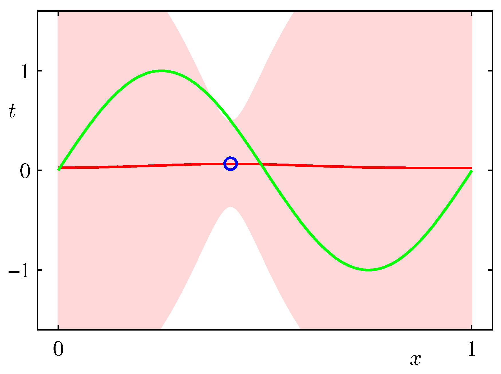

#  Bayesian Inference 

## The Bayes Rule 

*Thomas Bayes (1701-1761)*

The Bayesian theorem is the cornerstone of probabilistic modeling and ultimately governs what models we can construct inside the _learning algorithm_. If $\mathbf{w}$ denotes the unknown parameters, $\mathtt{data}$ denotes the dataset and $\mathcal{H}$ denotes the hypothesis set that we met in the learning problem chapter.

$$ p(\mathbf{w} | \mathtt{data}, \mathcal{H}) =  \frac{P(  \mathtt{data} | \mathbf{w}, \mathcal{H}) P(\mathbf{w} | \mathcal{H}) }{ P(  \mathtt{data} | \mathcal{H})} $$

The Bayesian framework allows the introduction of priors $p(\mathbf w | \mathcal{H})$ from a wide variety of sources: experts, other data, past posteriors, etc. It allows us to calculate the posterior distribution from the likelihood function and this prior subject to a normalizing constant. 

**We will call _belief_ the internal to the agent posterior probability estimate of a random variable as calculated via the Bayes rule.**

For example,a medical patient is exhibiting symptoms x, y and z. There are a number of diseases that could be causing all of them, but only a single disease is present. A doctor (the expert) has a _belief_ about the underlying disease, but a second doctor may have a slightly different _belief_.

### Bayesian approach vs Maximum Likelihood

In the Maximum Likelihood Estimation section we have seen a simple supervised learning problem that is specified via a joint distribution $\hat{p}_{data}(\mathbf x, y)$ and are asked to fit the model parameterized by the weights $\mathbf w$ using maximum likelihood. Its important to view pictorially perhaps the most important effect of Bayesian thinking in the regression setting: 

* The $\mathbf{w}$ in MLE is a point estimate $\mathbf{w}_{MLE}$ and we are plugging this estimate in the predictive distribution to make predictions $\hat y$ for data we havent seen before. 
  
*  In the Bayesian setting on the other hand we use a full distribution over $\mathbf w$. We predict by integrating over the posterior of $\mathbf{w}$ (i.e. given the data) and therefore considering organically the uncertainty of the posterior of $\mathbf{w}$ in our predictions.  As such it can capture the effects of sparse data producing more uncertainty via its covariance in areas where there are no data as shown in the following example which is exactly the same sinusoidal dataset fit with Bayesian updates and Gaussian basis functions.

 
 

ML frameworks have been enhanced recently to deal with Bayesian approaches and approximations that make such approaches feasible for both classical and deep learning. **TF.Probability** and **PyTorch Pyro** are examples of such enhancements. 

Before diving into the posterior update in regression problems its instructive to go over the Bayesian coin tossing notebook that shows a simpler experiment. 

<!-- ## Bayesian Linear Regression

The Probabilistic Graphical Model is a representation that is extensively used in probabilistic reasoning. Lets consider the simplest possible example of a graphical model and see how it connects to concepts we have seen before. Any joint distribution $p(\mathbf x, y)$ can be decomposed using the product rule (we drop the data qualifier) 

$$p(\mathbf x, y) = p(\mathbf x) p(y|\mathbf x)$$

and such distribution can be represented via the simple PGM graph (a) below. 

*Simplest possible PGM example*

We introduce now a graphical notation where we shade, nodes that we consider observed. Let us know assume that we observe $y$ as shown in (b). We can view the marginal $p(\mathbf x)$  as a prior over $x$ and and we can _infer_ the posterior distribution using the Bayes rule

$$p(x|y) = \frac{p(y|x)p(x)}{p(y)}$$

where using the sum rule we know $p(y) = \sum_{x'} p(y|x') p(x')$. This is a very innocent but very powerful concept.  -->

