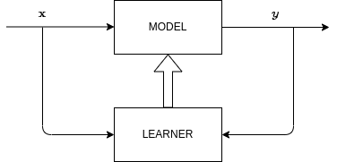

# The new premise
 
## The Premise of Data

Historically to solve a problem, inventors had to spent thousands of hours in developing _algorithms_ that can produce the desired outputs for certain inputs. For example the most well known algorithm to find shortest paths in graphs is a dynamic programming algorithm also known as Dijkstra's algorithm. 

_Find the shortest path between a and b (source: [wikipedia](https://en.wikipedia.org/wiki/Dijkstra%27s_algorithm))_ 

It picks the unvisited vertex with the lowest distance, calculates the distance through it to each unvisited neighbor, and updates the neighbor's distance if smaller. Mark visited (set to red) when done with neighbors.

In the new paradigm the learning agent is fed thousands of inputs and output pairs and via process that we will call training the early agent is developing a model that can produce desired outputs for inputs has that has _never_ seen before.

So what makes us believe that this new paradigm will offer productivity benefits compared to the old one ? It is a long ang twisted answer - in fact this answer is the whole point why we devote a whole course on trying to persuade you that the premise is valid.

