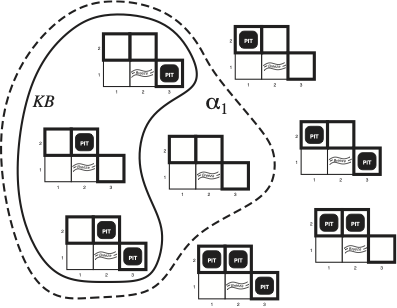
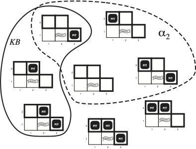
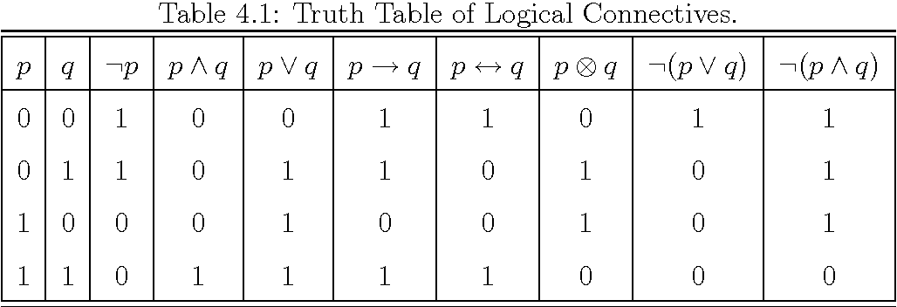
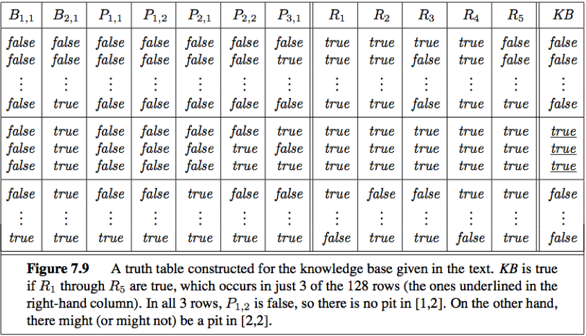

# Logical Inference

## A more general reasoning case

The wumpus world despite its triviality, contains some deeper abstractions that are worth summarizing. 

1. Logical inference can be done via an internal representation that are sentences - their syntax and semantics we will examined next. 
   
2. Sentences may be expressed in _natural_ language. Together with the perception and probabilistic reasoning subsystems that can generate symbols associated with a task, the natural language can be _grounded_ and inferences can be drawn in a 'soft' or probabilistic way at the symbolic level. 

To return to the backpack problem, for the sentence $\beta$ that declares that the backpack was abandoned, we need to entail a sentence $\alpha$ (and we denote it as $\alpha \models \beta$) that the backpack was handed over to $\mathtt{nobody}$ and therefore justify an action to sound the security alarm. Note the direction in notation: $\alpha$ is a stronger assertion that $\beta$.

The specific world model $m$ is a mathematical abstraction that fixes as TRUE or FALSE each of the sentences it contains and as you understand, depending on the sentences, it may or may not correspond to reality. We denote the set of models that _satisfy_ sentence $\alpha$ as $M(\alpha)$. We also say that $m$ is a model of $\alpha$. Now that we have defined the world model we can go back to the definition of entailment in the earlier example and write:

$$ \alpha \models \beta  \iff M(\alpha) ⊆ M(\beta)$$

## Model-Checking Algorithm

The reasoning algorithm regarding the possible state of the environment in surrounding cells that the agent performed informally above, is called _model checking_ because it enumerates _all possible_ models to check that a sentence $a$ is supported by the KB i.e. $M(KB) ⊆ M(\alpha)$. 


*Possible Models in the presence of pits in cells [1,2],[2,2] and [3,1]. There are $2^3=8$ possible models. The KB when the percepts indicate nothing in cell [1,1] and a breeze in [2,1] is shown as a solid line. With dotted line we show all models of $a_1=\text{"not have a pit in [1,2]"}$ sentence*. 


*Same situation as the figure above but we indicate with dot circle a different sentence $a_2$. What is this sentence?*

## Propositional Logic Syntax

The PL syntax defines the allowable sentences that can be complex. Each _atomic_ sentence consists of a single (propositional) symbol and the fixed symbols TRUE & FALSE. In BNF the atomic sentences or formulas are also called terminal elements. Complex sentences can be constructed from sentences using logical _operators_ (connectives that connect two or more sentences). In evaluating complex sentences the operator precedence shown in the figure below must be followed. 


*BNF grammar of propositional logic*

Out of all the operators, two are worthy of further explanation. 

1. imply (⇒) operator: the left hand side is the _premise_ and the  right hand side is the implication or conclusion or consequent. This is an operator of key importance known as **rule**. Its an if-then statement.
2. if and only if (⇔) operator: its expressing an equivalence (≡) or a biconditional. 

## Propositional Logic Semantics

The semantics for propositional logic specify how to compute the value of _any_ sentence given a model. To do so we use the following truth table.


*Truth tables for three primary and five derived logical operators. Note the presence of the XOR connective.*

Given a world model in the KB

$$m_1 = \left[ P_{1,2}=FALSE, P_{2,2}=FALSE, P_{3,1}=TRUE \right]$$

a sentence can be assigned a truth value (FALSE/TRUE) using the semantics above. For example the sentence,

$$\neg P_{1,2} \land (P_{2,2} \lor P_{3,1}) = TRUE $$

## Inference Example

Using the operators and their semantics we can now construct an KB as an example for the wumpus world. We will use the following symbols to describe atomic and complex sentences in this world. 

| Symbols   | Description                               |
| --------- | ----------------------------------------- |
| $P_{x,y}$ | Pit in cel [x,y]                          |
| $W_{x,y}$ | Wumpus (dead or alive) in cel [x,y]       |
| $B_{x,y}$ | Perception of a breeze while in cel [x,y] |
| $S_{x,y}$ | Perception of a stench while in cel [x,y] |

Using these symbols we can convert the natural language assertions into logical sentences and populate the KB. The sentences $R_1$ and $R_2/R_3$ are general rules of the wumpus world. $R_4$ and $R_5$ are specific to the specific world instance and moves of the agent. 

| Sentence | Description                                                                                                  | KB                                              |
| -------- | ------------------------------------------------------------------------------------------------------------ | ----------------------------------------------- |
| $R_1$    | There is no pit in cel [1,1]                                                                                 | $\neg P_{1,1}$                                  |
| $R_2$    | The cell [1,1] is breezy if and only if there is a pit in the neighboring cell.                              | $B_{1,1} ⇔ (P_{1,2} \lor P_{2,1})$              |
| $R_3$    | The cell [2,1] is breezy if and only if there is a pit in the neighboring cell.                              | $B_{2,1} ⇔ (P_{1,1} \lor P_{2,2} \lor P_{3,1})$ |
| $R_4$    | Agent while in cell [1,1] perceives [Stench, Breeze, Glitter, Bump, Scream]=[None, None, None, None, None]   | $\neg B_{1,1}$                                  |
| $R_5$    | Agent while in cell [2,1] perceives [Stench, Breeze, Glitter, Bump, Scream]=[None, Breeze, None, None, None] | $B_{2,1}$                                       |

As the agent moves, it uses the KB to decide whether a sentence is entailed by the the KB or not. For example can we infer that there is no pit at cell [1,2] ? The sentence of interest is $ \alpha = \neg P_{1,2}$ and we need to prove that:

$$ KB \models \alpha $$

To answer such question we will use the model checking algorithm outlined in this chapter: enumerate all models and check that $\alpha$ is true for in every model where the KB is true. We construct the truth table that involves the symbols and sentences present in the KB:



As described in the figure caption, 3 models out of the $2^7=128$ models make the KB true and in these rows the $P_{1,2}$ is false. 

Although the model checking approach was instructive, there is an issue with its complexity. Notice that if there are $n$ symbols in the KB there will be $2^n$ models, the time complexity is $O(2^n)$. 

The symbolic representation together with the explosive increase in the number of sentences in the KB as time goes by, cant scale. Another approach to do entailment, potentially more efficient, is  _theorem proving_ where we are applying _inference rules_ directly to the sentences of the KB to construct a proof of the desired sentence/query. Even better, we can invest in new representations as described in the PDDL chapter to develop planning approaches that combine search and logic and do not suffer necessarily from the combinatorial explosion problem. 

```{note}
If you need to review the BNF expressed grammar for propositional logic (as shown in the syntax above) review [part 1](https://www.youtube.com/watch?v=MMxMeX5emUA) and [part 2](https://www.youtube.com/watch?v=DiOxbYTLXX8) video tutorials. 
```