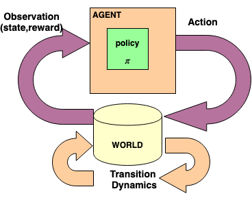
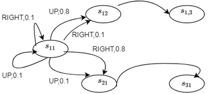
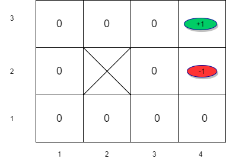
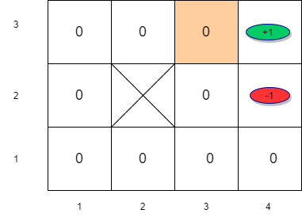
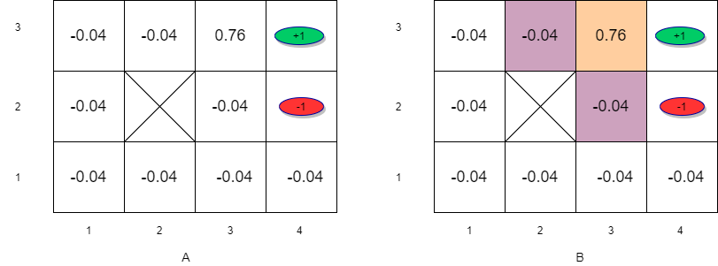

# Finding optimal policies in Gridworld 

<!-- .element width="700px" -->

* The environment is stochastic yet fully observable. 
* Due to uncertainty, an action causes transition from state to another state with some probability. There is no dependence on previous states. 
* We now have a sequential decision problem for a fully observable, stochastic environment with Markovian transition model and additive rewards  consisting of:
    * a set of states $S$. State at time $t$ is $s_t$
    * actions  $A$. Action at time $t$ is $a_t$.
    * transition model describing outcome of each action in each state $P( s_{t+1} | s_t,a_t)$ 
    * reward function $r_t=R(s_t)$ 

## MDP Transition Model

 

<!-- .element width="500px" -->
<!-- .element width="400px" -->

* Transition Model Graph:
	* Each node is a state.
	* Each edge is the probability of transition

## Utility for MDP

 

* Since we have stochastic environment, we need to take into account the transition probability matrix
* Utility of a state is the immediate reward of the state plus the expected discounted utility of the next state due to the action taken  
* **Bellman's Equations**: if we choose an action $a$ then 

$U(s) = R(s) + \gamma \sum_{s^{'}} P(s^{'}| s,a)U(s^{'})$ 

<!-- .element width="300px" -->
 
* Suppose robot is in state $s_{33}$ and the action taken is "RIGHT".  Also assume $\gamma = 1$
* We want to compute the utility of this state:
$$ U(s_{33})   =   R(s_{33}) +  \gamma (P(s_{43} | s_{33}, \rightarrow)  U(s_{43}) + P(s_{33} | s_{33}, \rightarrow)  U(s_{33}) + P(s_{32} | s_{33}, \rightarrow)  U(s_{32}))$$
* Substituting we get:

 $$U(s_{33}) = R(s_{33}) + \gamma ( (0.8 \times U(s_{43})) + (0.1 \times U(s_{33})) + (0.1 \times U(s_{23})))$$

## Policy for MDP

* If we choose action $a$ that maximizes future rewards, $U(s)$ is the maximum we can get over all possible choices of actions  and is represented as $U^{*}(s)$.

* We can write this as 
$$U^*(s) = R(s) + \gamma \underset{a}{ \max} (\sum_{s^{'}} P(s^{'}| s,a)U(s'))$$

* The optimal policy (which recommends $a$ that maximizes U) is given by:
  
$$\pi^{*}(s) = \underset{a}{\arg \max}(\sum_{s^{'}} P(s^{'}| s,a)U^{*}(s^{'}))$$

* Can the above $2$ be solved directly? 
  
  * The set of $|S|$ equations for  $U^*(s)$ cannot be solved directly because they are non-linear due the presence of 'max' function.
  
  * The set of $|S|$ equations for $\pi^*(s)$ cannot be solved directly as it is dependent on unknown $U^*(s)$.

## Optimal Policy for MDP

<!-- .element width="800px" -->

## Value Iteration 

* To solve the non-linear equations for $U^{*}(s)$ we use an iterative approach.
* Steps:
	* Initialize estimates for the utilities of states with arbitrary values: $U(s) \leftarrow 0 \forall s \epsilon S$
	* Next use the iteration step below which is also called **Bellman Update**: 

$$V_{t+1}(s) \leftarrow R(s) + \gamma \underset{a}{ \max} \left[ \sum_{s^{'}} P(s^{'}| s,a) U_t(s^{'}) \right] \forall s \epsilon S$$ 

	This step is repeated and updated

* Let us apply this to the maze example.  Assume that $\gamma = 1$

*Initialize value estimates to $0$*

## Value Iteration 

* Next we want to apply **Bellman Update**: 
  	$$V_{t+1}(s) \leftarrow R(s) + \gamma \max_{a} \left[\sum_{s^\prime} P(s^\prime | s,a)U_t(s^\prime) \right] \forall s \epsilon S$$
* Since we are taking $\max$ we only need to consider states whose next states have a positive utility value.
* For the remaining states, the utility is equal to the immediate reward in the first iteration.

### Value Iteration (t=0)

$$ V_{t+1}(s_{33})  =  R(s_{33}) + \gamma \max_a \left[\sum_{s^{'}} P(s^{'}| s_{33},a)U(s^{'}) \right] \forall s \in S $$

$$ V_{t+1}(s_{33}) =  -0.04 + \max_a \left[ \sum_{s'}  P(s'| s_{33},\uparrow) U_t(s'), \sum_{s'}  P(s'| s_{33},\downarrow)U_t(s'), \sum_{s'}  P(s'| s_{33},\rightarrow) U_t(s'),  \sum_{s'}  P(s'| s_{33}, \leftarrow)U_t(s')  \right]$$

$$V_{t+1}(s_{33})  =  -0.04 + \sum_{s^{'}}  P(s^{'}| s_{33},\rightarrow) U_t(s^\prime) $$

$$V_{t+1}(s_{33}) = -0.04 + P(s_{43}|s_{33},\rightarrow)U(s_{43})+P(s_{33}|s_{33},\rightarrow)U(s_{33})+P(s_{32}|s_{33},\rightarrow)U_t(s_{32}) $$

$$V_{t+1}(s_{33}) =   -0.04 + 0.8 \times 1 + 0.1 \times 0 + 0.1 \times 0 = 0.76 $$

### Value Iteration (t=1)

*(A) Initial utility estimates for iteration 2. (B) States with next state positive utility*

$$V_{t+1}(s_{33}) =   -0.04 + P(s_{43}|s_{33},\rightarrow)U_t(s_{43})+P(s_{33}|s_{33},\rightarrow)U_t(s_{33}) +P(s_{32}|s_{33},\rightarrow)U_t(s_{32}) $$

$$V_{t+1}(s_{33}) = -0.04 + 0.8 \times 1 + 0.1 \times 0.76 + 0.1 \times 0 = 0.836$$

$$V_{t+1}(s_{23}) =  -0.04 + P(s_{33}|s_{23},\rightarrow)U_t(s_{23})+P(s_{23}|s_{23},\rightarrow)U_t(s_{23}) = -0.04 + 0.8 \times 0.76 = 0.568$$

$$V_{t+1}(s_{32}) =  -0.04 + P(s_{33}|s_{32},\uparrow)U_t(s_{33})+P(s_{42}|s_{32},\uparrow)U_t(s_{42}) +P(s_{32}|s_{32},\uparrow)U_t(s_{32})$$
$$V_{t+1}(s_{32}) = -0.04 + 0.8 \times 0.76 + 0.1 \times -1 + 0.1 \times 0= 0.468$$

### Value Iteration (t=2)

*(A)Initial utility estimates for iteration 3. (B) States with next state positive utility*

* Information propagates outward from terminal states
and eventually all states have correct value estimates 
* Notice that $s_{32}$ has a lower utility compared to $s_{23}$ due to the red oval state with negative reward next to $s_{32}$

### Value Iteration - Convergence

* Rate of convergence depends on the maximum reward value and more importantly on the discount factor $\gamma$. 
* The policy that we get from coarse estimates is close to the optimal policy long before $U$ has converged.
* This means that after a reasonable number of iterations, we could use: 
  $$\pi(s) = \arg \max_a \left[ \sum_{s^{'}} P(s^{'}| s,a)V_{est}(s^{'}) \right]$$
* Note that this is a form of **greedy** policy.
  

*Convergence of utility for the maze problem (Norvig chap 17)*

* For the maze problem, convergence is reached within 5 to 10  iterations

## Policy Iteration

* Alternates between two steps:
	 * Policy evaluation: given a policy, find the utility of states
	 * Policy improvement: given the utility estimates so far, find the best policy
* The steps are as follows:

	1. Compute utility/value of the policy $U^{\pi}$ 
	2. Update $\pi$ to be a greedy policy w.r.t. $U^{\pi}$: 
   $$\pi(s) \leftarrow \arg\max_a \sum_{s^\prime} P(s^\prime|s,a)U^{\pi}(s^\prime)$$
	3. If the policy changed then return to step $1$

* Policy improves each step and converges to the optimal policy $\pi^{*}$ 

<!-- .element width="225px" -->

