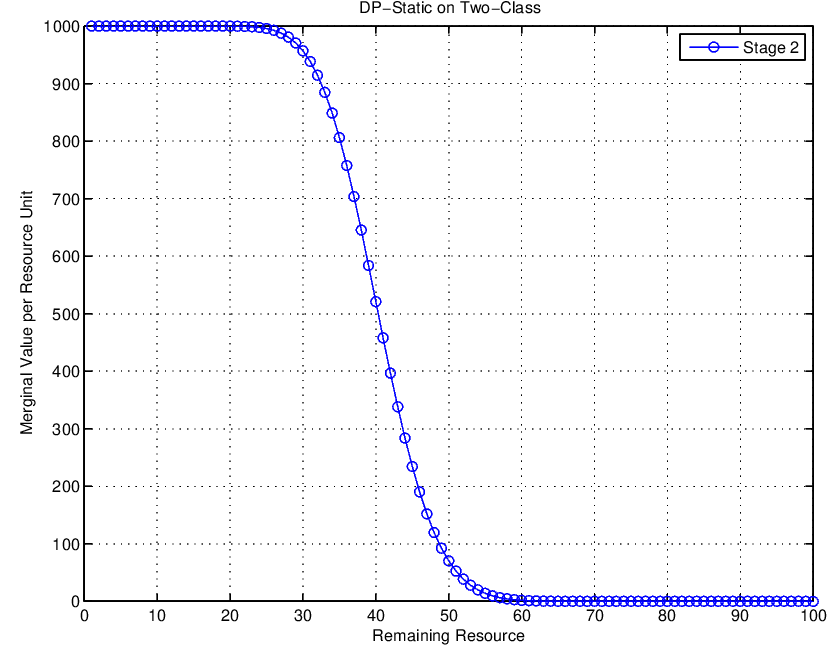
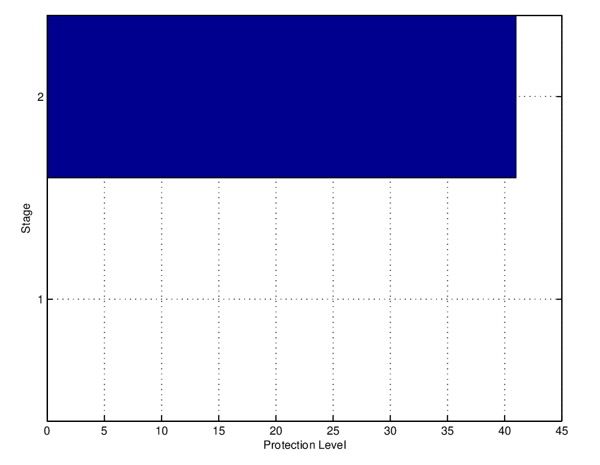
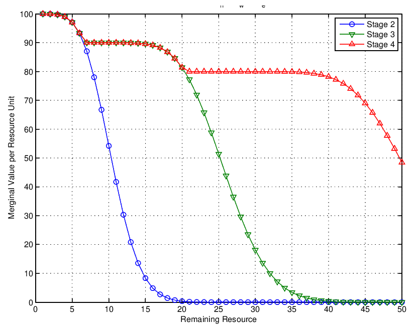
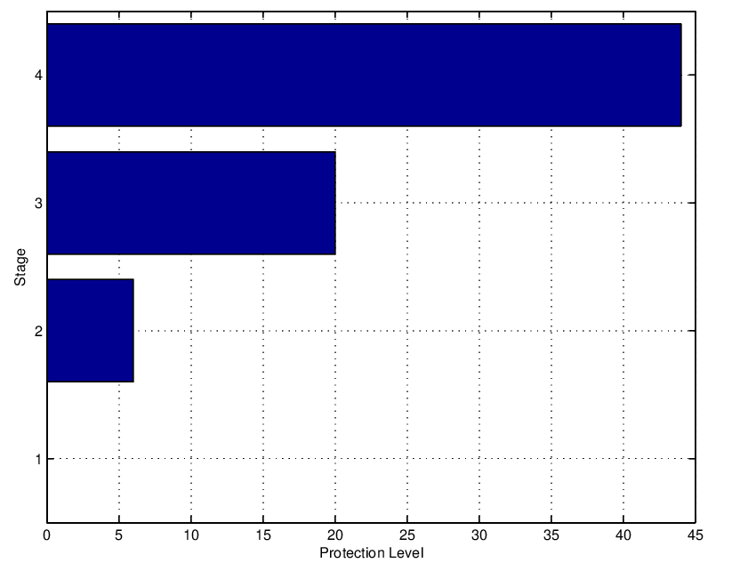

#  Optimal Capacity Control 

## Single Resource Capacity Control 

In this section we outline a capacity control policy that is routinely used in various industries (airlines, car rentals, hospitality) to make reservations towards a perishable capacity-constrained resource. 

Your job is to determine the knobs that implement the policy in a reservation system where customers are arriving to making a booking. We treat the simplest possible problem of a single resource. The intuition behind the heavy math below is simple[^1].

[^1]: It is probably the most essential first step as computer scientists to spend time understanding a domain / problem space and acquire such intuition as to how the system works.  

Capacity should be allocated to a request if and only if its revenue is greater than the value of the capacity required to satisfy the request. Second the value of capacity should be measured by its _expected displacement cost_ or opportunity cost which is the expected loss in future revenue from using the capacity now rather than protecting it for future use.

**The opportunity cost is captured using a value function $V(x)$ that measures the optimal expected revenue as a function of the remaining capacity $x$. The opportunity cost is then the difference between the $V(x)-V(x-1)$. This simply means that estimating the value function accurately is the most important requirement in our problem**.  

### Two class model

Let us assume that we are interested in allocating a resource of capacity $C$, to two different classes of consumers.Each class is represented by a price that consumers in this class will need to pay for one unit of this resource. Let $p_d$/$p_f$ and $D_d$/$D_f$ represent the prices and demands for the discounted/full-price classes respectively. The assumptions behind our model are:

* $p_d < p_f$
* $D_d$ and $D_f$ are independent random variables i.e. $p(D_d|D_f) = p(D_d)$.

The type $d$ demand arrives before type $f$ demand. This time dependency is not important and in practice it has been shown that does not result into significant deviations from optimality. 

Our aim is to find the a-priori protection level $y$ that represents the resource units that will be reserved for allocation to the type $f$ traffic. 

The maximum number of resource units that can be allocated to type $d$, i.e. the **available capacity** for type $d$, will then be,

$$C_d = C-y$$

The units that can be occupied by type $d$ cannot exceed the corresponding demand for this type i.e.,

$$S_d = \min (C_d,D_d)$$

Therefore the maximum number of resource units that can be allocated to type $f$, i.e. the _available capacity_ for type $f$, will then be,

$$C_f = C - \min (C_d,D_d) = \max(y,C-D_d)$$ 

The units that will be occupied by type $f$ is then,

$$S_f = \min (C_f,D_f)$$

The expected revenue from the occupied resources will be 

$$\mathbb E \{ p_d  S_d + p_f  S_f \}$$ 

where the expectation is taken over the random demands of the two types. If we maximize revenue over the protection level $y$, we obtain 

$$
V_d(C) = \max_{0 \le y \le C} \mathbb E \{p_d  S_d + p_f  S_f \}  = $$
$$ = \max_{0 \le y \le C} \mathbb E \{p_d  \min (C-y,D_d) + p_f \min \left( \max(y,C-D_d),D_f \right) \} 
$$

Intuitively, the ratio of the prices $r=\frac{p_d}{p_f}$ can help us determine some trends in setting the reservation level $y$. For if the ratio is very small, i.e. $p_f >> p_d$, then we would be inclined to reserve most of the overall capacity $C$ for type $f$ i.e $C_f >> C_d$. If on the other hand the ratio is close to 1, then we would be inclined to reserve only a very small capacity for type $f$ i.e. $C_f << C_d$, since we can get almost the same revenue with type $d$. 

Let us assume now that we set a fixed price ratio $r$ that is not close to these two extremes, and we then look at the remaining factors that can determine $y$ for optimal revenue. From the expressions above that factor seems to be the shape of the tail of the demand function for type $f$ i.e. $p(D_f > y)$. This is because we can only have the revenue for the capacity we reserved, if the associated demand is there i.e. if $D_f > y$. We can use Dynamic Programming (DP) to calculate the optimal reservation/protection limit. 


### Dynamic Programming Solution

To use a dynamic programming problem formulation, we need to define the variables at the beginning of the two periods involved. 

The first period is defined as the point just before the type $d$  demand is observed i.e. when the available capacity is $C$ and we define the value function $V_d(C)$ that represents the optimal expected revenue starting with $C$ units of capacity. Apparently an upper bound of this value function is $V_d(C) \le p_f C$, and this is obtained when we protect all the available capacity for type $f$.

Similarly, the second variable is the value function $V_f(x)$ that represents the optimal expected revenue starting with $x$ units of capacity just before observing $D_f$ or equivalently after we observe $D_d$. 

$$V_f(x) = \mathbb{E} \{p_f  \min(x,D_f)\}  =  p_f  \sum_{j=1}^x p(D_f \ge j)$$

where we have expanded $\mathbb E \{\min(x,D) \}$ using the rationale below.

{{<details "$\mathbb E\{\min(x,D)\}$">}}
Suppose that $D$ an integer quantity with $D > 0$ and $x$ is an integer, then,

$$E\{\min(x,D)\} = \sum_{j=0}^\infty \min(x,j)  Pr(D=j) $$
$$ =  0  Pr(D=0) + 1  Pr(D=1) + \dots + x  Pr(D=x) + x  Pr(D=x+1) + \dots $$
$$ Pr(D \ge 1) + Pr(D \ge 2) + \dots + Pr(D \ge x) =  \sum_{j=1}^x Pr(D \ge j) $$


The dynamic program formulation would involve relating $V_d(C)$ to $V_f(x)$. If we rewrite $V_d(C)$ from the result of the previous section,

$$ V_d(C)  =  \max_{0 \le y \le C}  \mathbb E \{p_d \min (C-y,D_d)\} +  \mathbb E \{ V_f(C_f) \}  = $$

$$ =  \max_{0 \le y \le C}    \mathbb E \{ p_d \min (C-y,D_d) \} +  \mathbb E \{ V_f(\max(y,C-D_d)) \} = \max_{0 \le y \le C} W(y,C)$$

The revenue difference from one unit of protection level is given by,

$$\Delta W(y,C) = W(y,C) - W(y-1,C) = [p_f p(D_f \ge y) - p_d] p(D_d \ge C-y)$$



We can prove the last equality as follows

$$ W(y,C) = \mathbb E \{p_d \min (C-y,D_d) + V_f(\max(y,C-D_d)) \} $$

$$W(y-1,C) = \mathbb E \{p_d \min (C-y+1,D_d) + V_f(\max(y-1,C-D_d)) \}$$

We can study two cases: 

| Case          | Description                                                                    |
| ------------- | :----------------------------------------------------------------------------- |
| $D_d \le C-y$ | $ \Delta W(y,C) = W(y,C) - W(y-1,C)$                                           |
|               | $ = \mathbb E \{p_d D_d + V_f(C-D_d) \} - \mathbb E \{p_d D_d + V_f(C-D_d)\} $ |
|               | $ = \mathbb E \{0 p(D_d \le C-y) \} =0 $                                       |
| $D_d > C-y$   | $ \Delta W(y,C) = W(y,C) - W(y-1,C)$                                           |
|               | $= \mathbb E \{p_d (C-y) + V_f(y) \} - \mathbb E \{p_d (C-y+1) + V_f(y-1) \}$  |
|               | $= \mathbb E \{ V_f(y)-V_f(y-1)-p_d \} p(D_d > C-y)$                           |

Then in all cases, the difference,


$\Delta W(y,C) = W(y,C) - W(y-1,C)$
$= \mathbb E \{V_f(y)-V_f(y-1)-p_d \} p(D_d > C-y)$
$= \mathbb E \{\Delta V_f(y)-p_d \} p(D_d > C-y)$

If we replace the marginal of the value function $V_f(y)$, with $\Delta V_f(y) = V_f(y)-V_f(y-1) = p_f  p(D_f \ge y)$ we get the final result:

$$\Delta W(y,C) = W(y,C) - W(y-1,C) = \mathbb E \{ p_f  p(D_f \ge y)-p_d \} p(D_d > C-y)$$

The term is $\Delta V_f(y)- p_d$ will start positive and then become negative i.e. the marginal value will have at least a local maximum. This can be simply shown if one replaces $y$ with $\infty$ which causes the term $p_f  p(D_f \ge y)-p_d \rightarrow -p_d$ and in the other extreme, if we replace $y$ with $0$ the term $p_f  p(D_f \ge y)-p_d \rightarrow p_f-p_d$. 

Note that the marginal value $V_f(x)$ itself reduces with remaining capacity $x$. The marginal value depends on how much the tail of the type-$d$ demand exceeds the available capacity. 


#### Calculating the Optimal Protection Limit and Maximum Revenue

The optimal $y$, denoted by $y^*$ can now be found as,

$$y^* = \max \{ y \in N_+: p_f  p(D_f \ge y^*) \ge p_d \} = \max \{ y \in N: p(D_f \ge y^*) \ge \frac{p_d}{p_f} \}$$

The optimal booking limit will then be 

$$b^* = (C-y^*)^+$$

The maximum possible revenue starting with capacity $C$ is given by,

$$V_d(C) =  \begin{cases} W(y^*,C) & \text{if } y^* \le C \\ W(C,C) & \text{if } y^* > C \end{cases}$$

Calculating $W(y^*,C)$ can be done recursively. We know that, 

$$W(y,C)  =  W(y-1,C)  + \mathbb E \{p_f  p(D_f \ge y)-p_d \} p(D_d > C-y)$$

To start the iteration we need $W(0,C)$ that can be written as,

$$W(0,C) = p_d  \mathbb E \{\min(C,D_d)\} + \mathbb E \{V_f(\max(0,C-D_d))\}$$

The first expectation can be written using partial expectations as,

$$\mathbb E \{\min(C,D_d)\} = \sum_{j=1}^C p(D_d \ge j)$$

The second expectation can be written as,

$$\mathbb E \{V_f(\max(0,C-D_d))\} = \sum_{j=0}^C V_f(C-j) p(D_d = j)$$

Then, starting from $W(0,C)$ we can calculate $W(1,C)$ and iterate until all $W(y^*,C)$ are calculated. 

### The Multiple Class Model

The value function for the multi-class problem is given by,

$$V_j(x) = \sum_{k=0}^{x-y-1} \left[p_j k + V_{j-1}(x-k) \right] p(D_j=k) + \left[p_j(x-y) + V_{j-1}(y)\right] p(D_j \ge x-y)$$

The implementation in Matlab as shown in the next listing.


```matlab
function Resource = value_function(Resource,stage,inpstruct)

% vector of all potential states (states represent the 
% remaining capacity)
x=1:inpstruct.Num_States;


% the pdf of the demand for this stage - P(D_j == x)
demand_pdf = poisspdf(x,inpstruct.mean_D(stage));

% the complementary cdf of the demand for this stage - P(D_j >= x)
demand_ccdf = 1-poisscdf(x,inpstruct.mean_D(stage));

if stage==1
    % The optimal protection level for this initial stage
    y_star_prev = 0;
else
    % The optimal protection level for this and subsequent stages
    y_star_prev = Resource{stage-1}.Protection_Level;
end
T=zeros(inpstruct.C,inpstruct.C);
% Calculate the value function V (note that we are reusing x defining 
%it as the state index)
for x=1:inpstruct.Num_States
    Resource{stage}.T(x,:)=0;
    for k=1:x-y_star_prev        
        T(x,k)= (inpstruct.price(stage) *  k + ...
        Resource{stage-1}.V(max(1,x-k)))* demand_pdf(k);
    end
    Resource{stage}.V(x) = sum(T(x,:)) + ...
            (inpstruct.price(stage)* max(0,x-y_star_prev) + ...
             Resource{stage-1}.V(max(1,min(x,y_star_prev)))) *...
                demand_ccdf(max(1,x-y_star_prev));      
end

% Calculate the marginal value of a single resource unit (DeltaV)
deltaV = diff(cat(2,0,Resource{stage}.V));
Resource{stage}.deltaV= deltaV;
% find the point of where the marginal value is larger than the price of
% the next stage 
indeces = find(deltaV > inpstruct.price(stage+1));
Resource{stage}.Protection_Level = max(indeces);
```


A number of calls equal to the number of stages are made. In each call, the corresponding results are stored for usage at the next stage. 

For a problem with available initial capacity $C=100$ and 2 demand classes shown below:

| Class | Price | Demand Distribution | Optimal Protection Levels |
| ----- | ----- | ------------------- | ------------------------- ||
| 1     | 1000  | Poisson(40)         | 41                        |
| 2     | 450   | Poisson(15)         | 100                       |

The marginal value as a function of the remaining resources.


_The marginal value as a function of the remaining resources_

The optimal protection limits are shown below. 



A further example shows the straightforward application of the same DP solution for more classes. The table below outlines the results for an available initial capacity $C=50$ and 4 demand classes. 

| Class | Price | Demand Distribution | Optimal Protection Levels |
| ----- | ----- | ------------------- | ------------------------- ||
| 1     | 100   | Poisson(10)         | 6                         |
| 2     | 90    | Poisson(15)         | 20                        |
| 3     | 80    | Poisson(25)         | 44                        |
| 4     | 70    | Poisson(15)         | 50                        |


_The marginal value as a function of the remaining resources for the three stages of the problem_

Its noteworthy to highlight the decreasing marginal value of capacity as the remaining capacity increases. This is intuitive as the more capacity we have remaining the less a unit of this capacity should be worth. Also, it is interesting to highlight the increasing value of marginal capacity with increasing stage. This is also intuitive as the earlier we are in stage i.e. the more time we have until we reach the final stage 1, the more a unit of capacity is worth if we allocate it at that stage.

The optimal protection limits are shown below. 




## References

[1] K. Talluri and G Van Ryzin, 'The Theory and Practice of Revenue Management', Springer, 2004. 