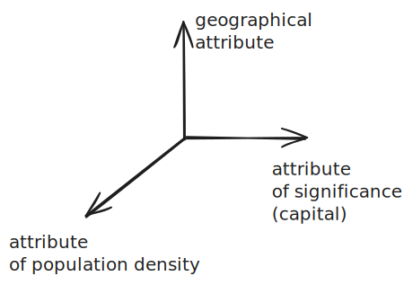
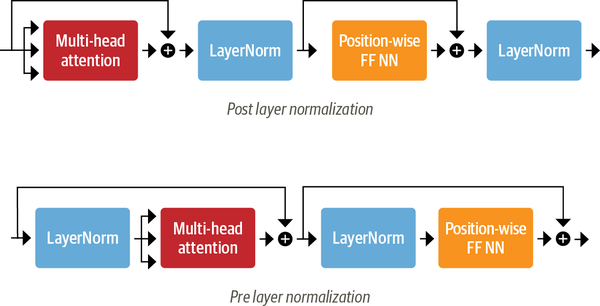

# Multi-head attention 

For the input sentence 

"London, inhabited by more than 10 million people, is the capital of England."

we understand that multiple relationships must be understood with respect to "London". For example, we need to understand that "London" is a place, is also an attribute ("capital") and is also a populous area. 



To capture such multiplicity of higher order meanings, we can use multiple attention heads. Each attention head will learn a different domain between the input tokens and will do so at the same time (in parallel).


The complexity of running multiple heads does not scale with the number of heads since as you can see in the code below we divide the earlier head size by the number of heads, avoiding a significant increase in the number of parameters.


```python
class MultiHeadAttention(nn.Module):
    def __init__(self, config):
        super().__init__()
        embed_dim = config.hidden_size
        num_heads = config.num_attention_heads
        head_dim = embed_dim // num_heads
        self.heads = nn.ModuleList(
            [AttentionHead(embed_dim, head_dim) for _ in range(num_heads)]
        )
        self.output_linear = nn.Linear(embed_dim, embed_dim)

    def forward(self, hidden_state):
        x = torch.cat([h(hidden_state) for h in self.heads], dim=-1)
        x = self.output_linear(x)
        return x
```

## Feedforward Layer

The feedforward layer is a simple linear layer with a GELU activation function.


One thing to note though is that each token is processed independently of the other tokens in the sequence. 

```python

class FeedForward(nn.Module):
    def __init__(self, config):
        super().__init__()
        self.linear_1 = nn.Linear(config.hidden_size, config.intermediate_size)
        self.linear_2 = nn.Linear(config.intermediate_size, config.hidden_size)
        self.gelu = nn.GELU()
        self.dropout = nn.Dropout(config.hidden_dropout_prob)

    def forward(self, x):
        x = self.linear_1(x)
        x = self.gelu(x)
        x = self.linear_2(x)
        x = self.dropout(x)
        return x
```

### Layer Normalization and Skip Connections

We also apply layer normalization to the input of the multihead self attention and feedforward layer. Borrowing the same idea we have seen from ResNet, we also add a skip connection from the input to the output of both. 



```python
class TransformerEncoderLayer(nn.Module):
    def __init__(self, config):
        super().__init__()
        self.layer_norm_1 = nn.LayerNorm(config.hidden_size)
        self.layer_norm_2 = nn.LayerNorm(config.hidden_size)
        self.attention = MultiHeadAttention(config)
        self.feed_forward = FeedForward(config)

    def forward(self, x):
        # Apply layer normalization and then copy input into query, key, value
        hidden_state = self.layer_norm_1(x)
        # Apply attention with a skip connection
        x = x + self.attention(hidden_state)
        # Apply feed-forward layer with a skip connection
        x = x + self.feed_forward(self.layer_norm_2(x))
        return x
```


## Resources

1. [Dimensioning Transformers - Part 1 ](https://towardsdatascience.com/transformers-explained-visually-part-3-multi-head-attention-deep-dive-1c1ff1024853)

2. [Dimensioning Transformers - Part 2](https://towardsdatascience.com/transformers-explained-visually-part-2-how-it-works-step-by-step-b49fa4a64f34)
