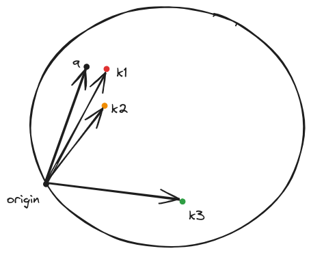
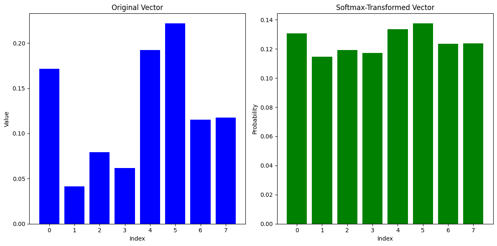
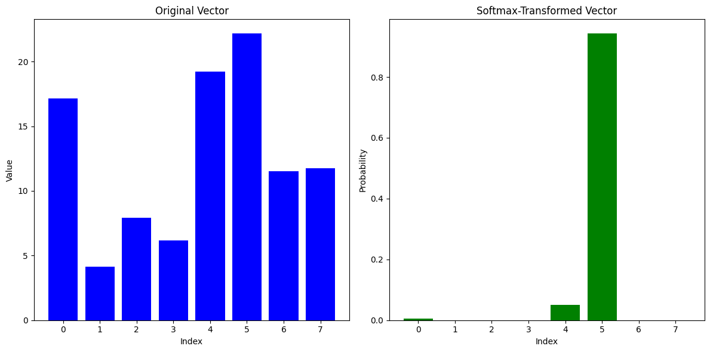

# Transformers and Self-Attention

```{admonition} Note

For the explanation of decoder-based architectures such as those used by GPT, please see the repo https://github.com/pantelis/femtotransformers and the embedded comments therein. A future version of this section will incorporate the commented source code from that repo as well as [this popular repo](https://github.com/lucidrains/x-transformers) that implements various other transformer architectures. 


```


*This is the original encoder-decoder architecture*

As compared to the RNNs we have seen earlier, in the transformer architecture we 

1. Eliminate all recurrent connections present in earlier RNN architectures, therefore allowing the model to be trained as well as produce inference results much faster.

2. Continue to use attention mechanisms to allow the model to focus on the most relevant parts of the input sequence. The attention mechanisms will be present in the encoder as well as the decoder part of the architecture if the transformer we are using has both of these parts obviously. 

    * This means that the encoder output for each input token will be a weighted sum of all other tokens, where the weights are computed by an attention mechanism called _self-attention_. The 'self' refers to the current token's generalized dot product with each and every other token of the input sequence itself.


## Simple self-attention mechanism  


In the figure above, a token is [dx1] vector with $d=4$ and we have $T=3$ tokens as the input sequence length (typically called block size).   Note on shown dimensions: We are in the process of modifying the figures to be inline with the nanoGPT (included in femtotransdformers) - the batch dimension is not shown here.

The self-attention mechanism is a mechanism that allows the model to focus on the most relevant parts of the input sequence. **Given the $i-th$ input token** having embedding $x_i$, we perform the following calculations:   

1. **Attention scores of the input token**: These are computed as dot products of the embedding of the input token and each of the embeddings of the tokens of the input sentence (including the input token itself). For example if the input sequence consists of 3 tokens, we will compute 3 attention scores for each token to obtain a 3x3 tensor.

2. **Attention weights**: The attention scores are then passed through a softmax function to obtain the corresponding _attention weights_.  Recall that the softmax function is a vector input - vector output function that maps the input vector to a vector of values between 0 and 1, where the sum of all values is 1. So we expect to get 3 attention weights. 

3. **Weighted embedding of the input token** : We then use the  attention weights to create a weighted sum of the token embeddings of the input sequence to obtain the new input token embedding i.e. the embedding that now includes information from all other embeddings of the input sequence.

$$\hat x_i = \sum_{j=1}^T \alpha_{ij} x_j$$

where $\alpha_{ij}$ is the attention weight of the $j-th$ token of the input sequence for the $i-th$ token of the input sequence of length T.

Self-attention layers can be stacked on top of each other to create a multi-layer self-attention mechanism.

## Scaled dot-product self-attention layer  

In the simple attention mechanism we have no trainable parameters, leaving the bulk of the effort in representation learning to the embedding layer.  The attention weights are computed derministically from these embeddings of each token of the input sequence. The way to introduce trainable parameters is via the reuse of the principles we have seen in RNN attention mechanisms.

In RNN encoder-decoder architecture, the current decoder state served as a _query_  and the encoder states $h_i$ serve as _keys_ and the contents of the hidden state as _values_. The attention weights are computed by comparing the query against each of the keys and passing the results via a softmax. The values are then used to create a weighted sum of the encoder hidden states to obtain the new decoder state ie. a vector that incorporates all the encoder hidden states.

In the transformer architecture we do something similar. 
 
#### Linear transformation of the input embeddings

This is done by multiplying the input embeddings with a corresponding matrix $W$. We have three such matrices $W^q, W^k, W^v$ and their role is _essential_.  

$$Q = XW^q$$
$$K = XW^k$$
$$V = XW^v$$

where $X$ is the input embedding matrix of size $T \times d$ where $T$ is the input sequence length and $d$ is the embedding dimension. $Q, K, V$ are the query, keys and values respectively and the dimensions of the $W^q, W^k, W^v$ matrices are $d \times d_k, d \times d_k, d \times d_v$ respectively. There is a reason why the queries and keys are projected to the same dimension $d_k$ and the values to a different dimension $d_v$. 

Think about the query as the representation of what the current token is seeking to find and the key as the representation of the token identity. Each token emmits these two vectors - for example 'I am key=vowel and I am looking for a query=consonant'. The attention mechanism will be able after training to reveal the keys of the input sequence that can best respond to the query.  

Let us now recall what we saw already during the `word2vec` construction: we trained a network that will take one-hot vectors of semantically similar tokens that were orthonormal and projected them to vectors that are close to each other in the embedding space.  So we have seen evidence that a projection matrix with proper weights can cause all sorts of interesting things to happen. By analogy, the multiplication of the matrix $W^q$ with the input token will create a vector (a point) in the d_k dimensional space that will represent the query. Similarly the multiplication of the matrix $W^k$ with each and every input tokens will create a vector (a point) in the d_k dimensional space that will represent the keys. **After training the keys that can best respond to the query will end up close to it**. 

#### Computation of the attention scores  

Now that we have projected the tokens in their new space we can form the generalized dot product

$$(W^qq)^TW^kk = q^T (W^q)^TW^kk=q^TWk$$ 

where q is the query vector and k is the key vector and $W$ is the product of the two spaces $W^q$ and $W^k$.

Geometrically you can visualize this as shown below:


_After training the keys that can best respond to the query will end up close to it_.

The direct consequence of this positioning in the $W$ vector space is that the dot product between the query and the nearby keys will be much larger than other far away keys.  

#### Scaling 

We then divide the result by the square root of the dimension of the key vector ($d_k$). This is done in to prevent the softmax from saturating on the higher attention score elements and severely attenuating the attention weights that correspond to the lower attention scores. 

We can do an experiment to see the bahavior of softmax. 

```python
import numpy as np

# Creating an 8-element numpy vector with random gaussian values
vector = np.random.randn(8)

# Softmax function
def softmax(x):
    e_x = np.exp(x - np.max(x)) # Stability improvement by subtracting the max
    return e_x / e_x.sum()

# Applying softmax to the vector
softmax_vector = softmax(vector)
softmax_vector
```

Lets plot the two results - the first case is when for the original vector and the second case is when the original vector is elementwise multiplied by 100. 





Multiply the attention scores by 100 and then pass them through a softmax. You will see that the softmax will output a vector of values that are either very close to 0 or 1.

The division by the $\sqrt{d_k}$ prevents this behavior. 

#### Masking

When we decode we do not want to use the attention scores of the future tokens since we dont want to train the tranformer using ground truth that will simply wont be available during inference since we need to preserve causality when we predict the next token during decoding. 

To prevent this from happening we mask the attention scores of the future tokens by setting them to $-\infty$ before passing them through the softmax. This will cause the softmax to output a vector of values that are very close to 0 for the future tokens.

#### Softmax 

We then pass the attention scores through a softmax function to obtain the attention weights $\alpha_{ij}$ for each of the $i$ tokens.

#### Weighting the values

We then use the attention weights to create a weighted sum of each of the value to obtain the new input embedding. 

$$\hat v_i = \sum_{j=1}^T \alpha_{ij} v_j$$

where $\alpha_{ij}$ is the attention weight of the $j-th$ token of the input sequence for the $i-th$ value of the input sequence of length T.

Why purpose the values play thouugh and why the $W^v$ matrix ?

The values are the actual information that the input token will use to update its embedding. The $W^v$ matrix is used to project the input tokens to values (points) in a $d_v$ dimensional space. As an example, if the key represented the consonantness of the input token that responded to a 'vowel' query, the value will represent the specific conconant. Its a way to separate the information that the input token will use to update its embedding from the information that the input token will use to update the embeddings of the _other_ tokens. In addition, there is no reason to make the dimensionality of the value space the same as the dimensionality of the key space.


_Note that masking is not shown in this figure. Also vector subspaces maintain the same dimensions throughout._

Closing, the overall equation for the scaled self-attention can be formulated as:

$$Attention(Q, K, V) = softmax(\frac{QK^T}{\sqrt{d_k}})V$$

and the dimensions of the tensors can also be extended to accommodate the batch dimension. 


## Positional embeddings explained

In the RNN architectures,tThe decoder state at time step $t$ was a function of the decoder state at time step $t-1$ and the input token at time step $t$.  In other words, the order of the tokens in the input sequential order was inherently maintained as the next hidden state could simply not be produced before the previous hidden state. 

In transformers, since we got rid of the recurring connections, we need to capture the order of the tokens in the input sequence with some other way. To do so, we use positional embeddings [^1]. 

See [here](https://theaisummer.com/positional-embeddings/) for an explanation of positional embeddings.


[^1]: Positional embeddings have replaced the so called positional encodings of earlier architectures. 


## Resources

1. An interesting video for the many attention mechanisms that are the roots of self-attention found in transformers. 

```{eval-rst}

.. youtube:: AIiwuClvH6k

```
2. Perhaps one of the best overviews of Transformers around with an implementation in TF. 

```{eval-rst}
.. youtube:: acxqoltilME

``` 

