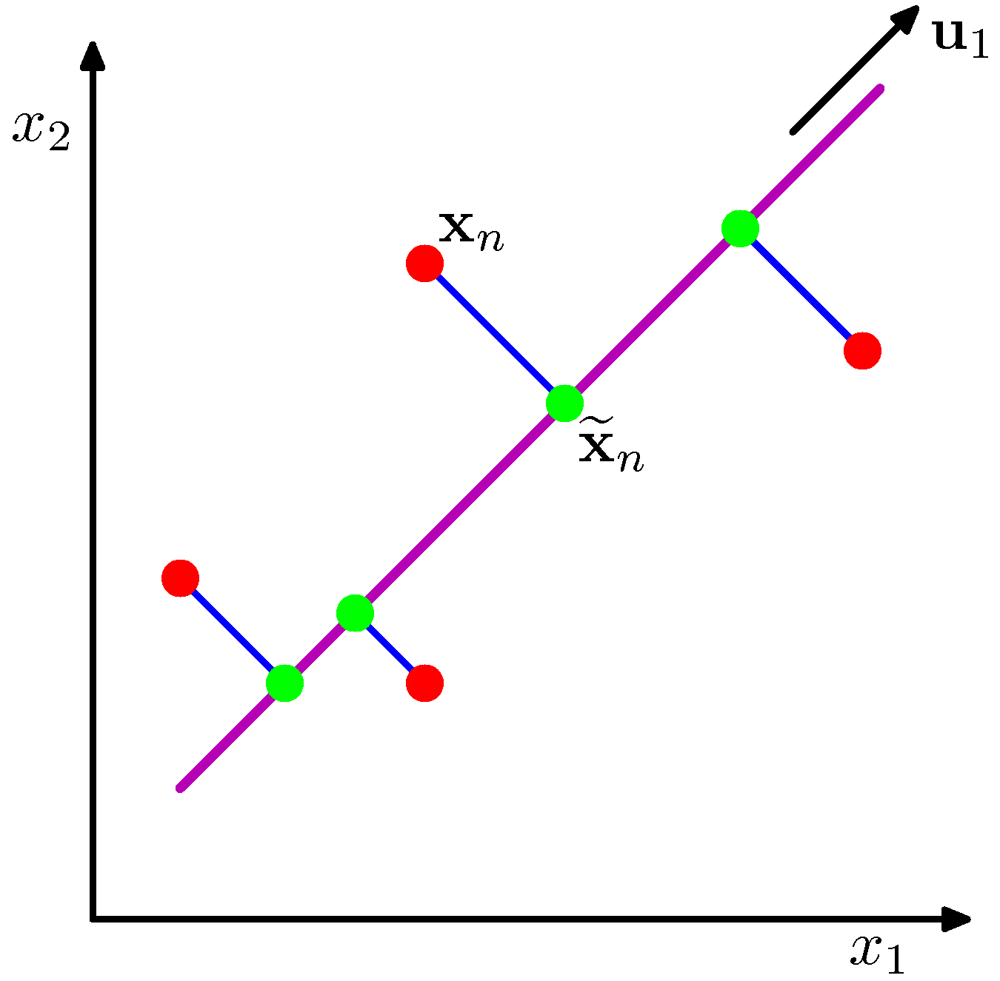

# Principal Component Analysis (PCA)

Consider an artificial data set constructed by taking one of the off-line digits, represented by a 64 x 64 pixel grey-level image, and embedding it in a larger image ofsize 100 x 100 by padding with pixels having the value zero (corresponding to white pixels) in which the location and orientation of the digit is varied at random, as illustrated in the figure below. 

*A synthetic data sel obtained by taking one of the off-line digit images and creating multiple copies in each of which the digit has undergone a random displacement and rotation within some larger image field. The resulting images each have 100 x 100 = 10.000 pixels*

Each of the resulting images is represented by a point in the 100 x 100 = 10,000-dimensional data space. However, across a data set of such images, there are _only three degrees of freedom of variability, corresponding to the vertical and horizontal translations and the rotations_. The data points will therefore live on a subspace of the data space whose intrinsic dimensionality is three. Note for real digit image data, there will be a further degree of freedom arising from scaling. Moreover there will be multiple additional degrees of freedom associated with more complex deformations due to the variability in an individual's writing as well as lhe differences in writing styles between individuals. 

Can we define PCA from a graphical point of view? This is shown in the next figure.

*PCA seeks a space of lower dimensionality (the magenda line) such that the orthogonal projection of the data points into the subspace maximizes the variance of the projected points (green dots) or equivalently minimizes the squared distances of the projection errors (blue lines)*

