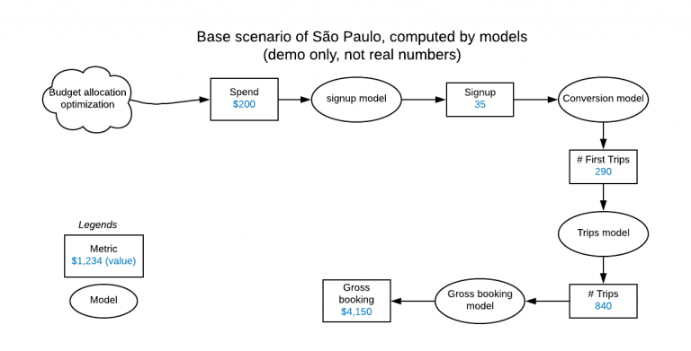
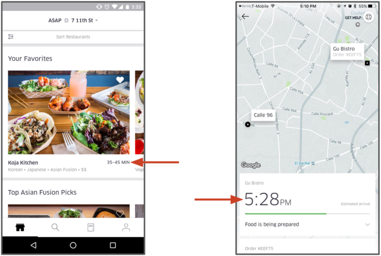
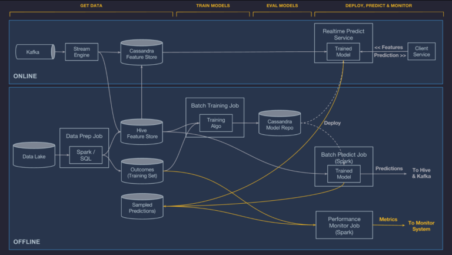
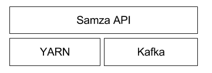

# A Case Study of an ML Architecture - Uber

Uber is one of the most interesting companies in terms of the data science task complexity that needs to be done to run their businesses. Obviously the business is diverse having ride sharing, food delivery, autonomous mobility and possibly others. Here we will focus on describing some of the problems and how they have been accommodated through [multiple generations of their in-house developed ML architecture](https://www.youtube.com/watch?v=hGy1cM7_koM). 

## Problem statements 

### Financial Planning 

Uber launched in San Francisco and this meant that they would be interacting regularly with the tech community who are continually looking for new tools and services that improve their quality of life. Uber took aim at those people by sponsoring tech events, providing free rides, and in general driving awareness among this audience. By [seeding](https://growthhackers.com/growth-studies/uber) this audience, they were able to create a growth engine that hinged on the fact that these adopters would show their friends, who would become new users after their first Uber experience. Leading to a growing network of passionate customers [ref](https://eng.uber.com/transforming-financial-forecasting-machine-learning/). 

Uber needs to do budget allocation for thousands of markets (cities) across the globe of their seeding moneys.  This resource allocation is implemented via financial planning backend services that generate and evaluate _scenarios_ for each market. The solution involves a combination of optimization approaches such as the Stochastic Gradient Descent (SGD) that we will treat in a later chapter and the usage of the Michelangelo platform to clean data, train, and serve models that will create the necessary metrics for each scenario - these are the variables of the objective or constraints in the budget optimization.


*Financial planning per market. Squares are metric (aggregations) and ovals are computational elements (models). Suppose the seeding process gives the São Paulo city team 200 dollars for new user acquisitions (acquisition_spending metric) and 100 dollars for existing user retention (engagement_spending metric). The cost curve model tells us that setting 200 dollars for the acquisition_spending metric will get us 35 new rider signups. By running our models in topological order, we can compute our metrics, including the very last one, a net_inflow of 1,274 dollars.*


### UberEATS


*Estimated Delivery Time (EDT) is the most important prediction affecting customer experience in the delivery industry.*

Predicting meal estimated time of delivery (ETD) is not simple. When an UberEATS customer places an order it is sent to the restaurant for processing. The restaurant then needs to acknowledge the order and prepare the meal which will take time depending on the complexity of the order and how busy the restaurant is. When the meal is close to being ready, an Uber delivery-partner is dispatched to pick up the meal. Then, the delivery-partner needs to get to the restaurant, find parking, walk inside to get the food, then walk back to the car, drive to the customer’s location (which depends on route, traffic, and other factors), find parking, and walk to the customer’s door to complete the delivery. To predict ETD Uber uses _Gradient Boosted Decision Tree regression models. Features for the model include 

1. request data (e.g., time of day, delivery location), 
2. historical features (e.g. average meal prep time for the last seven days), and 
3. near-realtime calculated features (e.g., average meal prep time for the last one hour). 

The goal is _not_ to predict once ETD but to _recalculate these time-to-delivery predictions at every step of the process_ [ref](https://eng.uber.com/michelangelo-machine-learning-platform/).

## [Michelangelo](https://eng.uber.com/michelangelo-machine-learning-platform/)


*Uber's Michelangelo system architecture (data flow view)*

```{eval-rst}
.. youtube:: Z3-HddkYgyI
```

The data processing pipeline elements we should be familiar with are listed below. 

| Pipeline                                                                                  | Component            | Description                                                                                                                                                                                                                                                                                                                                                                                                                                                                                                                                                                                                                                                                                                                                                                                                                                                                                                                                                                                                                                                                                                                                                                                                                                                                                                                                                                                                                   |
| ----------------------------------------------------------------------------------------- | -------------------- | ----------------------------------------------------------------------------------------------------------------------------------------------------------------------------------------------------------------------------------------------------------------------------------------------------------------------------------------------------------------------------------------------------------------------------------------------------------------------------------------------------------------------------------------------------------------------------------------------------------------------------------------------------------------------------------------------------------------------------------------------------------------------------------------------------------------------------------------------------------------------------------------------------------------------------------------------------------------------------------------------------------------------------------------------------------------------------------------------------------------------------------------------------------------------------------------------------------------------------------------------------------------------------------------------------------------------------------------------------------------------------------------------------------------------------- |
| [HDFS](http://hadoop.apache.org/)                                                         | Data Lake            | HDFS is used to create raw data repositories known as data lakes. The data lake in this use case stores all of Uber’s transactional and logged data.  Uber could have used [S3](https://aws.amazon.com/s3/) or other resilient file systems.                                                                                                                                                                                                                                                                                                                                                                                                                                                                                                                                                                                                                                                                                                                                                                                                                                                                                                                                                                                                                                                                                                                                                                                  |
| [Spark](https://spark.apache.org/)                                                        | DP Batch Processing  |  Apache Spark is a _unified_ computing engine and a set of libraries for parallel data processing on computer clusters. Spark is the most actively developed open source engine for this task - its for more traditional batch _analytics_ what Tensorflow and PyTorch is for deep learning.                                                                                                                                                                                                                                                                                                                                                                                                                                                                                                                                                                                                                                                                                                                                                                                                                                                                                                                                                                                                                                                                                            |
| [Kafka](https://kafka.apache.org/)                                                        | DP Messaging         |   Kafka is a distributed streaming platform. It can (a) Publish and subscribe to streams of records, similar to a message queue or enterprise messaging system. (b) Store streams of records in a fault-tolerant durable way. (c) Process streams of records as they occur.                                                                                                                                                                                                                                                                                                                                                                                                                                                                                                                                                                                                                                                                                                                                                                                                                                                                                                                                                                                                                                                                                                               |
| [Samza](http://samza.apache.org/learn/documentation/0.7.0/introduction/architecture.html) | DP Stream Processing |   Samza is an open source stream/event processing system that was [developed at LinkedIn](https://engineering.linkedin.com/blog/2018/11/samza-1-0--stream-processing-at-massive-scale). The use-cases include detecting anomalies, combating fraud, monitoring performance, notifications, real-time analytics, and many more. Today, Samza integrates not only with Apache Kafka, but also with many other systems, including Azure EventHubs, Amazon Kinesis, HDFS, ElasticSearch/OpenSearch, and Brooklin. Multiple companies like Slack, TripAdvisor, eBay, and Optimizely have adopted Samza. As you probably noticed, Kafka has the ability for stream processing but where Samza shines is on its ability to integrate and process events from other systems such as Azure and AWS.                                                                                                                                                                                                                                                                                                                                                                                                                                                                                                                                                                                                         |
| [Cassandra](https://cassandra.apache.org/)                                                | DP Feature Store     | Distributed, NoSQL database, first invented at Facebook. It presents a partitioned wide column storage model with eventually consistent semantics.  Consistency is an overloaded term in the database world, but for our purposes we will use the definition that a read always returns the most recently written value. Consider the case of two customers attempting to put the same item into their shopping carts on an e-commerce site. If I place the last item in stock into my cart an instant after you do, you should get the item added to your cart, and I should be informed that the item is no longer available for purchase. This is guaranteed to happen when the state of a write is consistent among all nodes that have that data.But as we’ll see later, scaling data stores means making certain trade-offs among data consistency, node availability, and partition tolerance. Cassandra is frequently called “eventually consistent,” which is a bit misleading. Out of the box, Cassandra trades some consistency in order to achieve total availability. But Cassandra is more accurately termed “tuneably consistent,” which means it allows you to easily decide the level of consistency you require, in balance with the level of availability. These tradeoffs are captured by the _CAP theorem_ proposed by Eric Brewer at the 2000 ACM Symposium on the Principles of Distributed Computing. |
|                                                                                           |                      | **Consistency**: All database clients will read the same value for the same query, even given concurrent updates. **Availability**: All database clients will always be able to read and write data. **Partition tolerance**: The database can be split into multiple machines; it can continue functioning in the face of network segmentation breaks. *CAP Theorem - you can only satisfy two of the three requirements.*                                                                                                                                                                                                                                                                                                                                                                                                                                                                                                                                                                                                                                                                                                                                                                                                                                                                                                                                                             |
| [Hive](https://hive.apache.org/)                                                          | DP Feature Store     | Developed by Facebook, this data warehouse software facilitates reading, writing, and managing large datasets residing in distributed storage using SQL.                                                                                                                                                                                                                                                                                                                                                                                                                                                                                                                                                                                                                                                                                                                                                                                                                                                                                                                                                                                                                                                                                                                                                                                                                                                                      |

These components are used to construct online (streaming) and offline (batch) processing data pipelines. The ultimate scope of a data pipeline is to create _features_, _training / test datasets_ and process data in the inference / prediction stage. We can clearly see two branches in Uber's and such separation is known as Lambda architecture - the name originated from the Greek letter $\Lambda$ that hs two "legs". Note that some authors call the online branch, the _streaming_ branch and the _offline_ branch, the _batch_ branch. This is generally accurate but in many instances we have mini batching done in the online branch so it is technically incorrect. 

| Lambda Architecture Branch | Description                                                                                                                                                                                                                                                                                                                                                                                                                                                                                                                                                                                                                                                   |
| -------------------------- | ------------------------------------------------------------------------------------------------------------------------------------------------------------------------------------------------------------------------------------------------------------------------------------------------------------------------------------------------------------------------------------------------------------------------------------------------------------------------------------------------------------------------------------------------------------------------------------------------------------------------------------------------------------- |
| Offline                    | Uber’s transactional and log data flows into an HDFS data lake and is easily accessible via Spark and Hive SQL compute jobs. Features in the Feature Store are automatically calculated and updated daily.                                                                                                                                                                                                                                                                                                                                                                                                                                                    |
| Online                     | Models that are deployed online cannot access data stored in HDFS, and it is often difficult to compute some features in the required latency directly from the online databases that back Uber’s production services. Instead, we allow features needed for online models to be precomputed and stored in Cassandra where they can be read at low latency at prediction time.  Cassandra is made in fact for this use case and is known for low latency reads via precomputatble expressions (eg the metrics in the financial planning use case).  For computing these online-served features, batch precompute and near-real-time compute options are used: |
|                            | **Batch precompute**. The first option for computing is to conduct bulk precomputing and loading historical features from HDFS into Cassandra on a regular basis. This is simple and efficient, and generally works well for historical features where it is acceptable for the features to only be updated every few hours or once a day.                                                                                                                                                                                                                                                                                                                    |
|                            | **Near-real-time compute**. The second option is to publish relevant metrics to Kafka and then run Samza-based streaming compute jobs to generate aggregate features at low latency. These features are then written directly to Cassandra for serving and logged back to HDFS for future training jobs. Like the batch system, near-real-time compute ensures that the same data is used for training and serving.                                                                                                                                                                                                                                           |

As an example, UberEATS uses batch precompute for features like a ‘restaurant’s average meal preparation time over the last seven days.' while the near-real-time precompute pipeline for features like a ‘restaurant’s average meal preparation time over the last one hour.’

## What to watch in data processing

Due to the plethora of platforms and runtimes to support stream and batch processing, it is difficult for data scientists to consolidate the various APIs and focus on the intelligence of a data driven application.  [Apache Beam](https://beam.apache.org/) was born out of this necessity and is enjoying widespread adoption (other than the vendor behind Spark). It offers the unified programming model that multiple runtimes support for both batch and real time streaming data intensive applications. For particularly illuminating use case of the complexities that raise in real applications, see [this tutorial](https://beam.apache.org/get-started/mobile-gaming-example/). For a use case that combines deep neural network regression in Tensorflow and data pipeline preprocessing in Beam see [this molecular analysis example](https://cloud.google.com/dataflow/docs/samples/molecules-walkthrough). 

Closing, we cant stress enough the importance of understanding the coupling between methods in data science (e.g regression methods for ETD calculation) and the data pipeline architecture that needs to be in place for the method to be able to provide good returns. Many cloud providers such as AWS, have published significant number of reference architectures for a variety of use cases and have on-site architects in NYC to help you understand how to best implement (arguably in their cloud) the data intensive application you need to build.  

# References

1. [Zillow](https://github.com/pantelis/handson-ml2/blob/master/02_end_to_end_machine_learning_project.ipynb), Notebook that shows end to end what a data mining pipeline does - here we predict house prices.  
2. [Real Time Data Infrastructure at Uber](https://arxiv.org/pdf/2104.00087.pdf)
3. 
```{eval-rst}
.. youtube:: _9VB21clg8E
```
