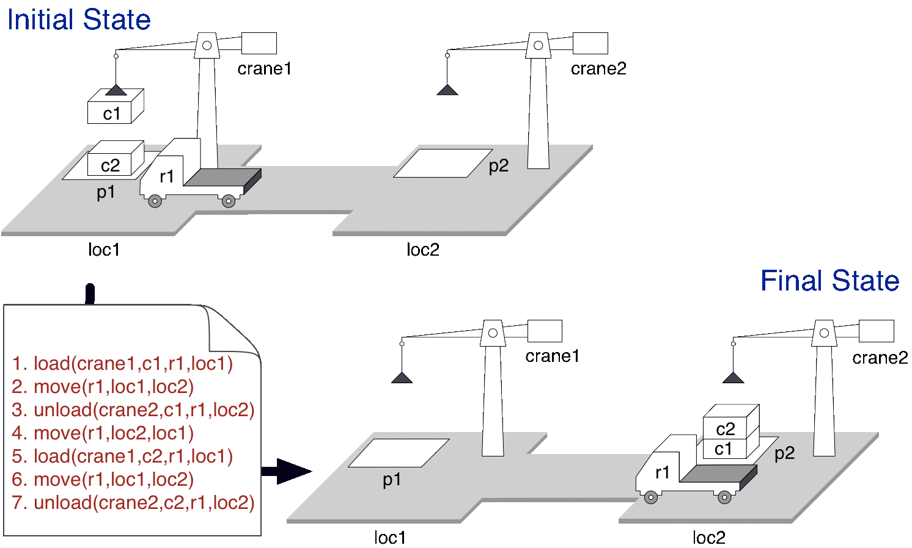

# Automated Planning

Planning combines two major areas of AI: logic and search. 

If we are able to express the domain and problem at hand in a suitably expressive language, with  logical reasoning we are able to infer if predicates are satisfied or not and in this chapter can use domain-independent solvers to find solutions (e.g. via search algorithms) of the best sequence of actions to reach our goal state. 

Lets take a closer look to an example of a planning application where robots have to transport containers and store them. We can cover every possibility of the system operation and every event and action that could be taken by the robot and we will soon face a combinatory explosion of the possible scenarios, vulnerability to failures from unexpected events. Automated planning (and re-planning) avoids this problem by allowing the system to compute a plan to achieve a goal from the current state of the system.

*The goal is to stack container c2 on container c1 at location p2. Automated planning allows to compute a sequence of actions (plan) that will allow the autonomous robots r1, crane1, crane2 to achieve this task from the initial state (c1 is on c2 at p1). If the initial state were different (due to an unexpected event), the system would still be able to compute another plan to fulfill the task (from PDDL4j).*

In the following sections we present techniques for a limited subset of automated planning 