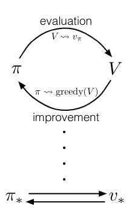

# Generalized Policy Iteration

As we saw in the dynamic programming (DP) solution MDP problem, policy iteration is an algorithm that  consists of two simultaneous, interacting processes: one making the value function consistent with the current policy (policy evaluation), and the other making the policy greedy with respect to the current value function (policy improvement).  

In policy iteration, these two processes, alternate, each completing before the other begins,but this is not really necessary.  In value iteration, for example, only a single iteration of policy evaluation is performed in between each policy improvement. 

In some cases a single state is updated in one process before returning to the other.  As long as both processes continue to update all states, the ultimate result is typically the same—convergence to the optimal value function and an optimal policy.

We  use  the  term generalized  policy  iteration (GPI)  to  refer to the general idea of letting policy-evaluation and policy-improvement processes interact, independent of the granularity and other details of the two processes.  **Almost all reinforcement learning algorithms are well described as GPI.** 

That is, all have identifiable policies and value functions, with the policy always being improved with respect to the value function and the value function always being driven toward the value function for the policy, as suggested by the diagram above.  If both the evaluation process and the improvement process stabilize, that is, no longer produce changes, then the value function and policy must  be  optimal. 

**The  value  function  stabilizes  only  when  it is consistent with the current policy, and the policy stabilizes only when it is greedy with respect to the current value function.** 

Thus, both processes stabilize only when a policy has been found that is greedy with respect to its own evaluation function.  This implies that the Bellman optimality equation holds, and thus that the policy and the value function are optimal. 

**The evaluation and improvement processes in GPI can be viewed as both competing and cooperating.**  They compete in the sense that they pull in opposing directions.  Making the policy greedy with respect to the value function typically makes the value function incorrect for the changed policy, and making the value function consistent with the policy typically causes that policy no longer to be greedy.  In the long run,  however,  these two processes interact to find a single joint solution:  the optimal value function and an optimal policy.

_We have seen this diagram in policy iteration where the arrows takes the system all the way to achieving one of the two goals completely.  **In GPI one could also take smaller, incomplete steps toward each goal (not shown)**.  In either case, the two processes together achieve the overall goal of optimality even though neither is attempting to achieve it directly._

## GPI Algorithms

The following tables summarize the algorithms between sample backup and full backup and are provided in this GPI section for reference. 

*Backup Trees for DP vs TD.*

*Update equation comparison between DP vs TD* 

