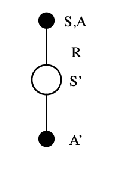
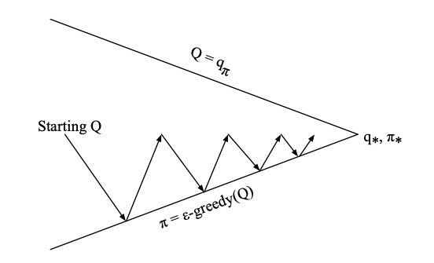

# The SARSA Algorithm 

SARSA implements a $Q(s,a)$ value-based GPI and naturally follows as an enhancement from the $\epsilon-greedy$ policy improvement step of MC control. 

We meet also here the familiar two steps: 

1. The first is a technique for learning the Q-function via TD-learning that we have seen in the prediction section. 

2. The second is a method for evolving the policy using the learned Q-function. 

## SARSA - TD Learning

In the TD prediction section, we have met the TD prediction step for $V(s)$ but for control we need to predict the $Q(s,a)$. 

The TD(0), also known as single-step TD, tree for SARSA is shown below:

*SARSA action-value backup update tree. Its name is attributed to the fact that we need to know the State-Action-Reward-State-Action before performing an update.* 
 
Following the value estimate of _temporal difference (TD) learning_, we can write the value update equation as:

$$Q(S,A) = Q(S,A) + \alpha (R + \gamma Q(S^\prime, A^\prime)-Q(S,A))$$

Effectively the equation above updates the Q function by $\alpha$ times the direction of the TD error. What SARSA does is basically the policy iteration diagram we have seen in the control above but with a twist. Instead of trying to evaluate the policy using episodes as in MC,  SARSA does policy improvement on an estimate obtained **over each time step** significantly increasing the iteration rate - this is figuratively shown below:

*SARSA on-policy control*

The idea is to increase the frequency of the so called $\epsilon$-greedy policy improvement step where we select with probability $\epsilon$ a random action instead of the action that maximizes the $Q(s,a)$ function (greedy). We do so, in order to "hit" new states and therefore improve on the degree of exploration of our agent and as a result giving opportunities to the agent to reduce its variance _and_ its bias. 

The SARSA algorithm is summarized below:

*SARSA algorithm for on-policy control*
