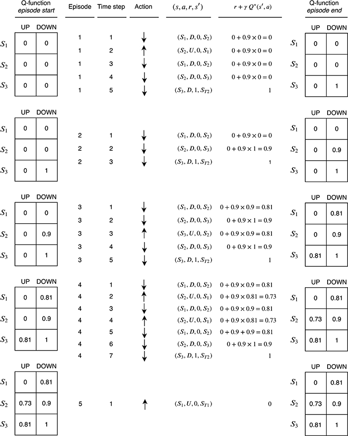

# Example of $Q(s,a)$ Prediction

Suppose an agent is learning to play the toy environment shown above. This is a essentially a corridor and the agent has to learn to navigate to the end of the corridor to the good terminal state $s_{T2}$, denoted with a star. 

* There are five states in total.   The agent always starts the game in state $s_1$, denoted $S$, and the game ends if the agent reaches either of the terminal states. $s_{T2}$ is the goal state—the agent receives a reward of 1 if it reaches this state.
* There are only two actions, $a_{UP}$ and $a_{DOWN}$. 
* The agent receives rewards of 0 in all other states. 
* The agent’s discount rate γ is 0.9. 
* The game is  optimally solved by a policy which reaches $s_{T2}$ in the smallest number of steps because an agent values rewards received sooner more than rewards received later in time. In this case, the smallest number of steps an agent can take to optimally solve the environment is 3.

How can we learn the optimal Q function? 

The diagram is split into five blocks from top to bottom. Each block corresponds to a single episode of experiences in the environment; the first block corresponds to the first episode, the second block the second episode, and so on. Each block contains a number of columns. They are interpreted from left to right as follows:

* **Q-function episode start**: The value of the Q-function at the start of the episode. At the beginning of episode 1, all of the values are initialized to 0 since we have no information yet about the function.

* **Episode**: The episode number.

* **Time step**: Each block contains a variable number of experiences. For example, there are three experiences in episode 2 and seven experiences in episode 4. The time index of each experience within the block is indicated by the time step.

* **Action:** The action the agent took at each time step.
* $(s, a, r, s′)$: The agent’s experience at each time step. This consists of the current state s, the action the agent took a, the reward received r, and the next state the environment transitioned into s′.
* $r + γQ*(s′, a)$: The target value (i.e., the right-hand side of the equation) to use in the Bellman update: 

$$Q*(s, a) = r + γQ*(s^\prime, a^\prime)$$

* **Q-function episode end**: The value of Q-function at the end of the episode. The Bellman update has been applied for each experience of the episode in time step order. This means that the Bellman update was applied first for the experience corresponding to time step 1, then time step 2, and so on. The table shows the final result after all of the Bellman updates have been applied for the episode.

*TD Q-function learning*
