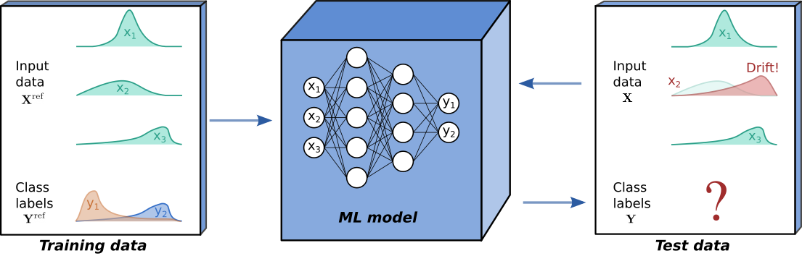

# Streaming Data (online) Drift Detection

Although powerful, modern machine learning models can be sensitive. Seemingly subtle changes in a data distribution can destroy the performance of otherwise state-of-the art models, which can be especially problematic when ML models are deployed in production. Typically, ML models are tested on held out data in order to estimate their future performance. Crucially, this assumes that the process underlying the input data and output data  remains constant.

Drift is said to occur when the process underlying and  at test time differs from the process that generated the training data. In this case, we can no longer expect the model’s performance on test data to match that observed on held out training data. At test time we always observe features , and the ground truth then refers to a corresponding label. If ground truths are available at test time, supervised drift detection can be performed, with the model’s predictive performance monitored directly. However, in many scenarios, such as the binary classification example below, ground truths are not available and unsupervised drift detection methods are required.

In this project you are called to develop a system that will perform online drift detection which requires processing Kafka streams. You will use 

## Tasks

https://concept-drift.fastforwardlabs.com/

https://github.com/fastforwardlabs/concept-drift

https://docs.seldon.io/projects/alibi-detect/en/stable/index.html
