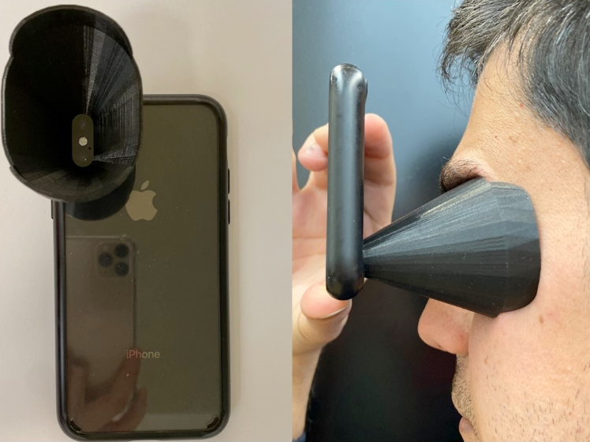
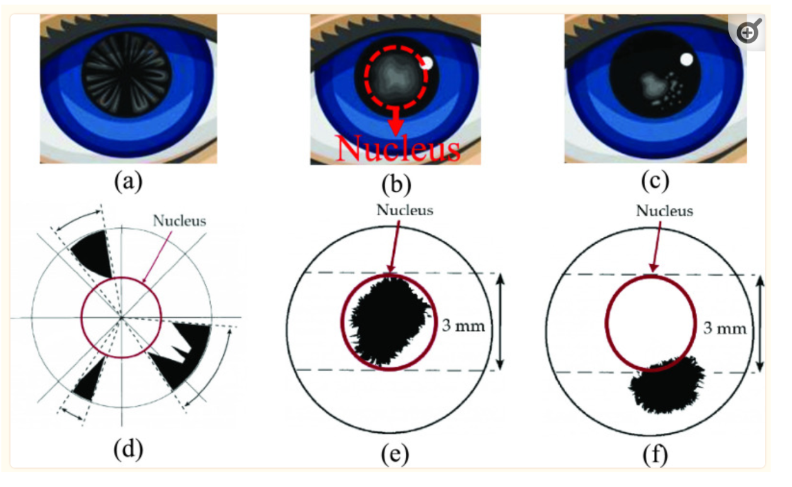

# Smartphone-based Cataract Detection

## Introduction

You are tasked to develop a machine learning pipeline that will help optometrists to detect cataract disease in the eye. The pipeline will be used in a mobile application that will be used by patients to take pictures of the eye and then the application will automatically detect the presence of cataract disease in the eye. The application will be particularly important in remote areas where there is limited access to eye specialists. In the process of building this application you will be also exposed to the various transformations that are needed for the data to be at the right orientation and the right size for the model to be able to make predictions.

## Dataset

The different types of cataract disease are depicted in [this reference](https://www.ncbi.nlm.nih.gov/pmc/articles/PMC8580365/):  

(a) cortical cataract and (d) demonstration of its location on the lens - this is class 1 in the dataset,

(b) nuclear sclerotic cataract and (e) demonstration of its location on the lens - this is class 2 in the dataset,

(c) posterior capsular cataract and (f) demonstration of its location on the lens - this is class 3 in the dataset.

You are [given images](https://www.kaggle.com/datasets/nandanp6/cataract-image-dataset?resource=download) from both healthy (class 0) and from patients with catact disease (classes 1-3). 

NOTE: Please note that although [other cataract datasets exists](https://www.kaggle.com/datasets/jr2ngb/cataractdataset?resource=download), they are unsuitable for the application as they require specialized equipment to capture the images.

<!-- https://uwspace.uwaterloo.ca/bitstream/handle/10012/16788/Nasir%20zonouzi_Mona.pdf?sequence=3&isAllowed=y

https://www.iab-rubric.org/resources/biometric-datasets/iris -->

## Model

You need to develop a semantic segmentation model that will be able to determine masks that correspond to each of the types of cataract disease and their posterior probability distribution. To do so you will use a model called U-Net that is particularly good at semantic segmentation.

## Evaluation

