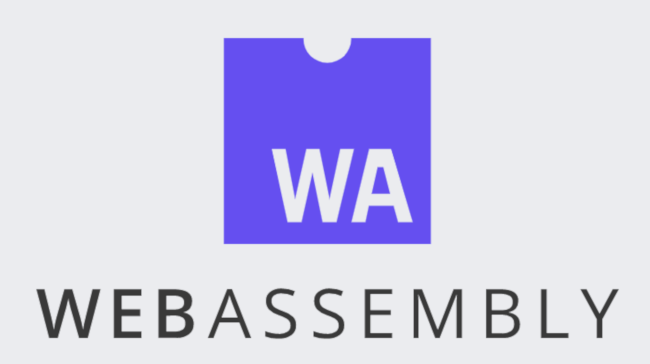
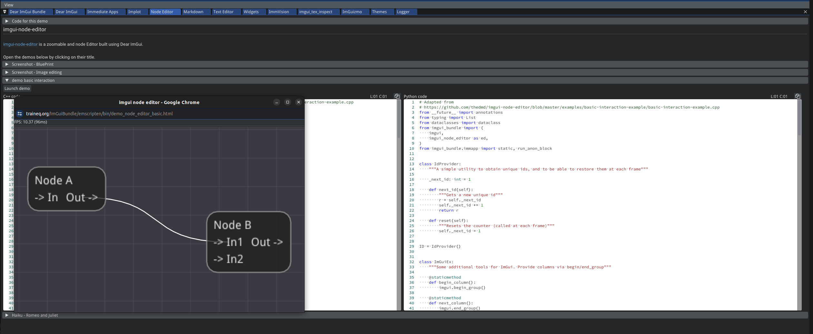

# Webassembly (WASM) media pipelines

```{note}
The specification below is subject to change and can be modulated depending on common interests between the Professor and the student(s). We will be sharing with you earlier work in this project so you will inherit a codebase.  By starting this project you will commit to continue working on it during the summer up to and including a web app launch. 

The project will be graded bearing in mind the amount of work you will be able to do in the time frame of the course - you can secure a max of 100 points for this project at the end of the course despite not having completed Task 3. 
```



This is a project for those that want to work on infrastructure / framework level code and have strong background in C. The goal is to create a framework for running perception pipelines using webassembly components. This will allow us to run perception tasks **in the browser or in the cloud without tight coupling with specific language runtimes**. 

The value proposition of this project: 

* pipelines can run in the client browser preserving privacy when applications cannot transmit user data to the cloud. 
* WASM runtimes are secure by design as they run in a sandbox. 
* pipelines can run in the cloud using webassembly runtimes such as [wasmtime](https://wasmtime.dev/) and can support a variety of languages and environments including optionally GPU acceleration. 
* Ease of use: pipelines can be built using a visual editor and can be deployed to the cloud or to the browser.

```{note}
Please [note the relationship between MediaPipe and this project](https://www.it-jim.com/blog/mediapipe-intro/). Both projects are working on similar problems, having said that the gstreamer basis caters to strong real-time media processing and inherits the NVIDIA Deepstream nodes and plugins that accelerate media processing on NVIDIA GPUs.
```

## Project Goals

To demonstrate media processing using wasm pipelines we will build a simple application that can take a video stream from a webcam and apply a machine learning model to detect objects in the video stream.  **You do not need to have access to an NVIDIA GPU to work on this project.**

The project will be broken down into the following tasks:

### Task 1: Familization with Gstreamer (15 points)


[Gstreamer](https://gstreamer.freedesktop.org/documentation/application-development/introduction/gstreamer.html?gi-language=c) is an open source pipeline-based cross-platform extensible multimedia framework and has been adopted by major players in mission-critical use cases that need to process video and other ream-time streams. It also underpins [NVIDIA's DeepStream](https://developer.nvidia.com/deepstream-sdk) implementation. 


To get started in [Gstreamer](https://gstreamer.freedesktop.org/) please watch  **[this](https://www.youtube.com/watch?v=ZphadMGufY8)** video. [This additional](https://www.youtube.com/watch?v=_yU1kfcC6rY) hands-on addresses NVIDIA pipeline elements. 

### Task 2: Dear ImGui Bundle UI (35 points)

The Gstreamer pipeline will be configured and controlled by [the Dear ImGui Bundle UI](https://code-ballads.net/annoucing-dear-imgui-bundle/) and extension of the Dear ImGui [that is heavily used](https://github.com/ocornut/imgui/wiki/Software-using-dear-imgui) for games and heavyweight computational applications such as [Blender](https://www.blender.org/) and NVIDIA Omniverse.

For a browser experience see [this demo](https://traineq.org/ImGuiBundle/emscripten/bin/demo_imgui_bundle.html). 

More specifically we need the capabilities of the Node Editor that allows gstreamer pipelines to be specified in the browser visually. 

There is a [demo of this](https://www.youtube.com/watch?v=xqWDQs47HGE) but the repo is not provided.  In a desktop native app (as this video shows) the gstreamer visual editor will work as expected.  In a WASM environment, the visual editor pipeline maybe displayed in the browser but the internals of Gstreamer may not work aka the pipeline wont execute in the wasm env (see task 2). 

So the implementation for this tak has only the visual editing component in the browser but the execution is still being done using the C-language executable. One environment that this can be used in Jupyter notebooks where you can have the pipeline editor in one cell as shown [here](https://www.youtube.com/watch?v=QQIC7lpHono) and the gstreamer pipeline execute in another cell as shown [here]( https://github.com/sean-halpin/gstreamer_jupyter/blob/master/notebooks/intro.ipynb). 




```{note}
The Dear ImGui Bundle python SDK allows the UI to be coded in Python. 
```

### Task 3: WebAssembly (50 points)

In this task, the gstreamer pipeline is executed in the WASM sandbox. We can have  one pipeline per WASM sandbox (suitable for a browser execution) or one gstreamer element mapped to a WASM sandbox (suitable for scaling to the serverless cloud environments).

The implementation is being done [here](https://fluendo.com/en/blog/gstwasm-gstreamer-for-the-web/) and the effort is presented in [this video](https://gstconf.ubicast.tv/videos/gstwasm-gstreamer-for-the-web/). 

Webassembly runtimes such as [wasmtime](https://wasmtime.dev/) or serverless platforms such as  [cloudflare workers](https://developers.cloudflare.com/workers/runtime-apis/webassembly/) or [AWS Lambda](https://aws.amazon.com/lambda/) can be used for the cloud demo. 

This section will be updated to reflect the results of the prototype that help us define the appropriate runtime for this project. 


