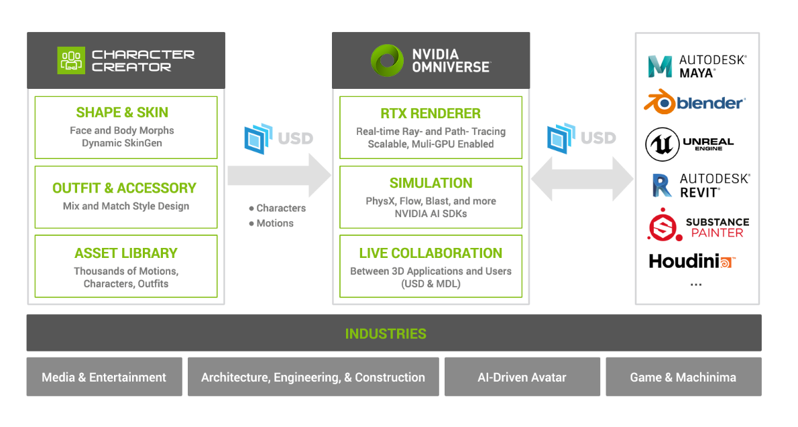

# Learning in Simulated Worlds

In this project, open **only to students in possession of a workstation or laptop equipped with RTX NVIDIA GPUs**,  you are going to demonstrate how machines can learn from machines that render a virtual world that is a digital twin of a real world. 

## Deploy the NVIDIA Isaac Sim Containers (10 points)



Follow the directions to download the Isaac SDK 2021.1. Note that you need NVIDIA RTX2080 GPU with driver version 450+. Prefer the container based installation - there are no data scientists that don't know how to use containers. If you have a monitor attached to the workstation (common) then follow the non-headless container instructions and vise-versa if you don't. As the capabilities that will be developed will be based on Omniverse, complete [the Omniverse overview/tutorials](https://developer.nvidia.com/nvidia-omniverse-developer-resource-center). Write all setup instructions that worked for you in the project wiki - see last paragraph. 

## Creating Synthetic ML datasets in Isaac (35 points)

Training perception models requires large and diverse datasets. Assembling these datasets can be costly, time-consuming, dangerous and even impossible for certain corner cases. By leveraging the synthetic data generation capabilities of Isaac Sim, you can bootstrap the training task. In the early phases of a project, synthetic data can accelerate proof of concepts or validate ML workflows. In later stages of a development cycle, real data can be augmented with synthetic data to reduce the time for training a production model.  

Isaac Sim has built in support for **Domain Randomization (DR)** allowing for changes in texture, colors, lighting, and placement. It also features support for different types of data including bounding boxes, depth, and segmentation. 



Study [the Domain Randomization paper](https://arxiv.org/pdf/1703.06907.pdf) and write a 2-page (single spaced) summary of why DR helps perception machine learning  tasks such as object detection and/or segmentation. You need to type the summary in markdown + png files. 

You will now implement DR to get the results needed to validate your arguments in the report.  

1. Ensure that you have installed Unity3D in your system that that you are able to [connect IsaaC and Unity3D](https://docs.nvidia.com/isaac/isaac/doc/simulation/unity3d.html#isaac-sim-unity3d). You should be able to load the small warehouse scene at the end of this step  (5 points)

2. You will be given access to ShapeNet data (link will be published in the course slack) which you will download to your workstation. 

3. You will then select K objects ($K> 5$) out of Shapenet that are compatible with a warehouse environment/scene and follow the directions [here]()
See [this page](https://docs.omniverse.nvidia.com/app_isaacsim/app_isaacsim/sample_syntheticdata.html) for a demo of a synthetic data pipeline.

## Transfer Learning (45 points)

You will output the datasets in the [KITTI forma](https://docs.nvidia.com/tao/archive/tlt-20/tlt-user-guide/text/preparing_data_input.html) making it easier to leverage [NVIDIA’s Transfer Learning Toolkit](https://docs.nvidia.com/tao/archive/tlt-20/tlt-user-guide/text/overview.html).

1. Follow the directions [here](https://developer.nvidia.com/blog/deploying-real-time-object-detection-models-with-isaac-sdk-and-transfer-learning-toolkit/) to implement transfer learning and train an object detector on synthetic data. 

2. Obtain graphs of object detection metrics (see corresponding lecture) vs. number of samples in the synthetic dataset.  

