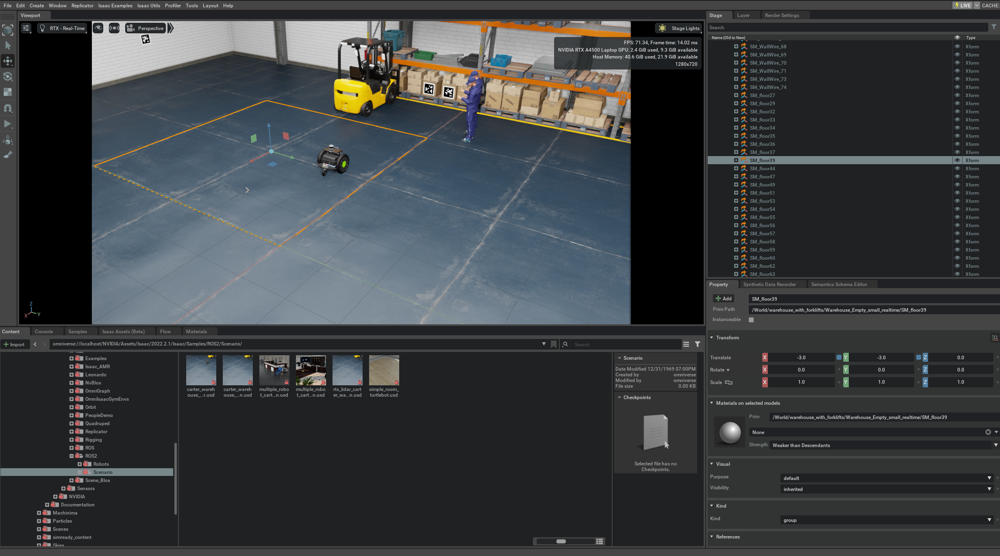

# Natual Language Guided Robotics



## Introduction

```{note}
This is a team project - those that are part of this team will be selected after an interview process. Please message the professor if you are interested **and** if you have a 16-CPU-core machine with 32GB of RAM and an NVIDIA GPU with $\ge$ 12-GB of VRAM. 

The specification below is subject to change and can be modulated depending on common interests between the Professor and the student(s). We will be sharing with you earlier work in this project so you will inherit a codebase.  By starting this project you will commit to continue working on it during the summer up to and including a paper publication. 

The project will be graded bearing in mind the amount of work you will be able to do in the time frame of the course - you can secure a max of 100 points for this project at the end of the course despite not having completed all milestones. 
```

Our main aim for this project is to demonstrate the connection between robotics and large language models, showcasing a task-driven interaction between humans and robots that is based on natual language. 

## Milestone 1 - Set up the ROS2 environment (25 points)

In this milestone you will learn ROS2 and set up your ROS2 development environment.  

Please watch this video series (you have access to it via your NYU library O'Reilly: https://learning.oreilly.com/videos/ros2-for-beginners/10000DIVC2022146/) You need to complete this in 1 week.  Watch only the Python sections. 

You also need to bookmark the ROS2 Humble documentation pages.


## Milestone 2 (25 points)
Project will involve an egomotion robot that finds itself in a warehouse environment and will be able to localize itself using VSLAM. VSLAM is an evolved version of the Bayesian filter we did in class. Your task is to replicate the implementation shown here  https://github.com/NVIDIA-ISAAC-ROS/isaac_ros_visual_slam#isaac-ros-visual-slam 

The robot must be able to move and avoid crashing when it travels from point A to B inside the warehouse. 

## Milestone 3 (25 points)

We will use the warehouse environment to create a system that will have the robot describe what it sees generating text from the perception system. To do so we will use the [imagebind model](  https://ai.facebook.com/blog/imagebind-six-modalities-binding-ai/ https://arxiv.org/abs/2305.05665) or other appropriate models. 

We need to create additional sensors in the robot (a camera that will be fish-eye 360deg) and as the robot moves it will report "I am passing through isle 4", "I am seeing this landmark in front of me" etc.  

## Milestone 4 (25 points)

The robot will be able to take commands from the user to execute a task. The user will be able to say "Go to isle 4" and the robot will be able to navigate to isle 4. The interface will be chat-based and future enhancements will roll out a voice-oriented interface.  

